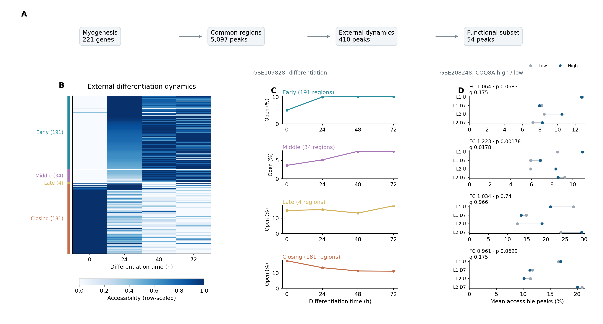
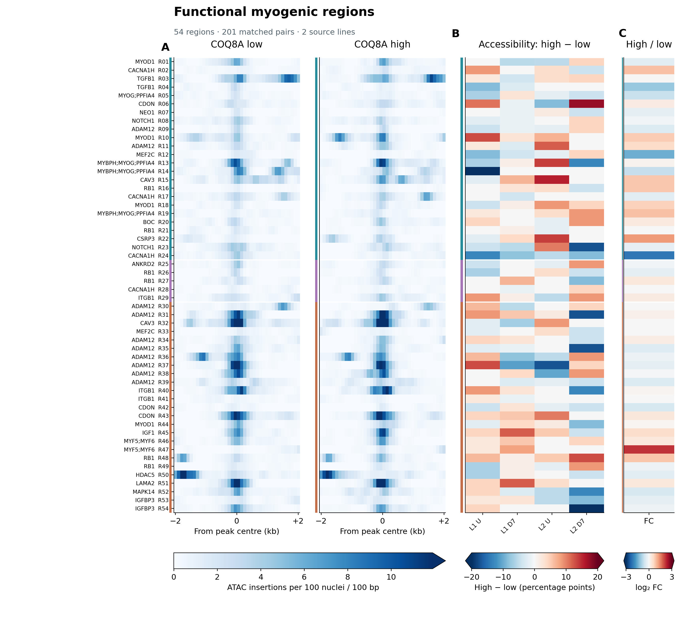
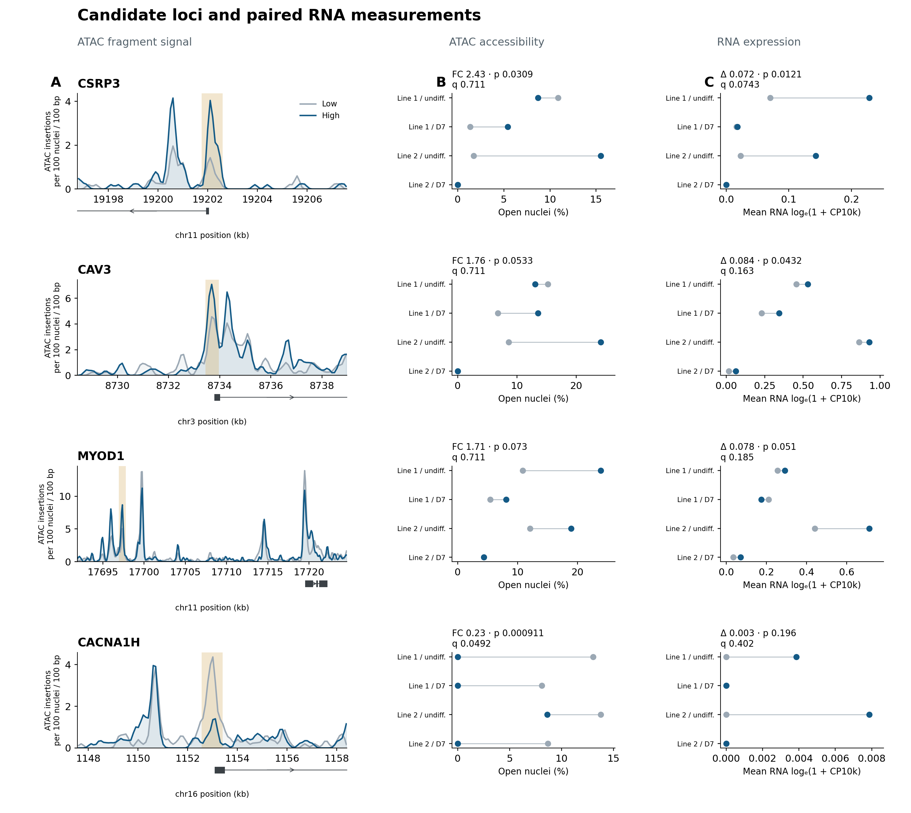

# COQ8A-associated chromatin accessibility during myogenesis

## Completed CAV3 and GSE240061 exploration — 2026-09-27

The new [analysis and results](docs/REPLICATION_ANALYSIS_AND_RESULTS.md) include 288 external-scope comparisons,
448 replication settings, donor-level statistics, model stress tests and figures.
GSE240061 differential accessibility has now been analyzed. The sections below
retain the preceding analysis and its specific settings.

New figures: [external CAV3 scope](figures/replication/Figure_1_CAV3_functional_scope.png),
[CAV3 sensitivity heatmap](figures/replication/Figure_2_CAV3_sensitivity.png),
[six-donor follow-up](figures/replication/Figure_3_CAV3_donor_followup.png),
[distal candidate](figures/replication/Supplement_distal_candidate.png).
Regenerate with `python scripts/71_summarize_replication.py`.

Reproducible analysis of paired human RNA/ATAC measurements at regions defined
by an independent myoblast differentiation time course.

## Study design

**Biological scope → external temporal definition → COQ8A association → locus and RNA follow-up**

1. The measured Hallmark/Reactome myogenesis union contains **221 genes**.
2. Their annotated neighborhoods contain **5,097 peaks common to four GSE208248 libraries**.
3. Independent GSE109828 differentiation data define **191 early, 34 middle,
   four late and 181 closing regions**.
4. External GO annotations for differentiation, fusion and regulation define
   **54 functional dynamic regions**, including opening and closing regions.
5. Compare COQ8A-high (≥3 RNA UMI) with low (1 UMI), using joint TSS ≥3 QC and
   **201 depth-matched pairs within libraries**. Repeat the complete comparisons
   with the specified TSS/count sensitivities.

The target data comprise **two donor-derived lines, each undifferentiated and
day-7 differentiated**. The four libraries are not four independent donors.
This repository analyzes association in processed public data.

## Main figures

### Figure 1 — External definition and temporal-module association

The external time course defines the regions. The aligned COQ8A comparison
then tests each temporal class. The middle module has FC **1.223**, paired
p **0.00178**, and BH q **0.0178** across the ten temporal programme tests.



### Figure 2 — Complete functional-region screen

All **54 regions** are shown in the same external-time order: matched-nucleus
ATAC insertion profiles, within-library accessibility differences and pooled
fold changes. Each row is one genomic interval; nearby gene names can repeat.



### Figure 3 — Candidate loci and paired RNA

Four follow-up loci are shown with actual fragment profiles, accessibility
fractions and RNA from the same matched nuclei. CSRP3, CAV3 and MYOD1 have
positive pooled accessibility directions; CACNA1H illustrates a decrease.
The figure reports both p and q and does not imply that all four pass FDR.



Vector PDFs accompany all PNGs. [Supplementary figures](figures/supplement)
contain the 221-gene TSS heatmap and the complete four-setting module comparison.

## Reproduce the figures

Python 3.13:

```bash
python -m pip install -r requirements.txt
python run_paper.py --mode figures
```

This command uses committed source tables and fragment profiles, regenerates
the figures, and validates their statistical inputs. No private RNA data or
multi-gigabyte downloads are needed for this route.

## Recompute from deposited processed data

Download the GSE208248 H5 matrices and barcode metrics listed in
[Data availability](docs/DATA_AVAILABILITY.md), and GENCODE v48. Then run:

```bash
python run_paper.py --mode analysis --h5-root /data/GSE208248 --gtf /data/gencode.v48.annotation.gtf.gz --external-raw /data/GSE109828 --external-work /work/GSE109828
```

The command downloads the external reference, reconstructs temporal membership,
tests the fixed contrasts and generates figures. It reuses the versioned
fragment-QC tables. Add `--fragments /data/fragments` with `pysam` installed to
rebuild figure fragment profiles. Full QC regeneration and all analytical
definitions are in [Methods](docs/METHODS.md).

## Documentation and source data

- [Candidate provenance and independent replication](docs/CANDIDATE_PROVENANCE_AND_REPLICATION_PLAN.md):
  how CAV3 entered follow-up, identical evidence columns for every candidate,
  and the GSE240061 replication design.
  [Complete candidate audit](results/candidate_provenance).
  [GSE240061 measured feasibility](docs/GSE240061_FEASIBILITY_RESULTS.md)
  reports actual group sizes, matching and regional coverage.

- [Independent enhancer intersections](docs/EXTERNAL_ENHANCER_INTERSECTION.md):
  human HSMM strong-enhancer annotation, MYOD1 ChIP and core MRF neighborhoods.
  [Coordinate/time-course figure](figures/external_enhancers/MYOD1_external_annotation_and_time.png)
  and [source tables](results/external_enhancers).

- [Temporally unstratified exploration](docs/UNSTRATIFIED_LINK_EXPLORATION.md): all
  5,097 shared candidate peaks, nominal effects and peak–RNA count-model follow-up.
  [Exploration figure](figures/unstratified/Unstratified_peak_RNA_exploration.png)
  and [complete source tables](results/unstratified).

- [Middle-region target-link follow-up](docs/MIDDLE_LINK_REASSESSMENT.md): expanded
  nucleus population, count models, stratified bootstrap and independent MYOD1
  annotation. [Follow-up figure](figures/link_followup/Middle_peak_RNA_associations.png)
  and [source tables](results/link_followup) are separate from the main high/low tests.

- [Enhancer-region exploration](docs/ENHANCER_REGION_EXPLORATION.md): sample-size
  audit, external cell-context selectivity, and region-level tests without a MYOD
  occupancy filter. [Broad results](results/enhancer_regions) and
  [selective-region results](results/enhancer_selective_regions).
- [Candidate expansion and external datasets](docs/CANDIDATE_EXPANSION_AND_EXTERNAL_DATA.md):
  source-level comparisons, independent C2C12 RNA/ATAC reference, and additional
  dataset inventory. [Candidate evidence](results/candidate_comparison) and
  [external C2C12 results](results/external_c2c12).
- [Methods](docs/METHODS.md): samples, preprocessing, thresholds, matching, statistics and provenance.
- [Figure legends](docs/FIGURE_LEGENDS.md): panel definitions, signal units and statistical families.
- [Results](docs/RESULTS.md): current numerical findings.
- [Code availability](docs/CODE_AVAILABILITY.md) and [Data availability](docs/DATA_AVAILABILITY.md).
- [Figure source data](results/figure_source), [functional results](results/functional),
  [temporal results](results/temporal) and [sample/scope inventories](results/design).

Private C2C12 passage/time results are analyzed separately and are not deposited
here. Generic code for that comparison is provided with an external-output requirement.
